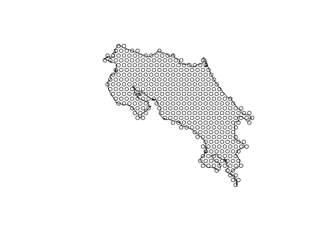

Creating Presence Absence Matrices for Costa Rican Birds
================
Motmots Lab Group
18 September 2021

# 1 Overview

This study uses ecological niche models created using minimum volume
ellipsoids by MF Velde. These models are spatially restricted around two
test localities for a different concurrent project; these restrictions
will have little to any effect on the studies performed herein.

First, we need to load the relevant packages.

``` r
library(ape)
library(data.table)
library(dismo)
library(ggplot2)
library(raster)
library(rgdal)
library(rgeos)
library(sf)
library(tidyverse)
library(vegan)
library(velox)

# also cite ggplot2, loaded with ecostructure
```

    ## Loading required package: raster

    ## Loading required package: sp

    ## 
    ## Attaching package: 'raster'

    ## The following object is masked from 'package:data.table':
    ## 
    ##     shift

    ## The following objects are masked from 'package:ape':
    ## 
    ##     rotate, zoom

    ## Please note that rgdal will be retired by the end of 2023,
    ## plan transition to sf/stars/terra functions using GDAL and PROJ
    ## at your earliest convenience.
    ## 
    ## rgdal: version: 1.5-27, (SVN revision 1148)
    ## Geospatial Data Abstraction Library extensions to R successfully loaded
    ## Loaded GDAL runtime: GDAL 3.2.1, released 2020/12/29
    ## Path to GDAL shared files: /usr/share/gdal
    ## GDAL binary built with GEOS: TRUE 
    ## Loaded PROJ runtime: Rel. 7.2.1, January 1st, 2021, [PJ_VERSION: 721]
    ## Path to PROJ shared files: /home/kupeornis/.local/share/proj:/usr/share/proj
    ## PROJ CDN enabled: FALSE
    ## Linking to sp version:1.4-5
    ## To mute warnings of possible GDAL/OSR exportToProj4() degradation,
    ## use options("rgdal_show_exportToProj4_warnings"="none") before loading sp or rgdal.

    ## rgeos version: 0.5-7, (SVN revision 676)
    ##  GEOS runtime version: 3.9.0-CAPI-1.16.2 
    ##  Please note that rgeos will be retired by the end of 2023,
    ## plan transition to sf functions using GEOS at your earliest convenience.
    ##  GEOS using OverlayNG
    ##  Linking to sp version: 1.4-5 
    ##  Polygon checking: TRUE

    ## Linking to GEOS 3.9.0, GDAL 3.2.1, PROJ 7.2.1

    ## ── Attaching packages ─────────────────────────────────────── tidyverse 1.3.1 ──

    ## ✓ tibble  3.1.4     ✓ dplyr   1.0.7
    ## ✓ tidyr   1.1.3     ✓ stringr 1.4.0
    ## ✓ readr   2.0.1     ✓ forcats 0.5.1
    ## ✓ purrr   0.3.4

    ## ── Conflicts ────────────────────────────────────────── tidyverse_conflicts() ──
    ## x dplyr::between()   masks data.table::between()
    ## x tidyr::extract()   masks raster::extract()
    ## x dplyr::filter()    masks stats::filter()
    ## x dplyr::first()     masks data.table::first()
    ## x dplyr::lag()       masks stats::lag()
    ## x dplyr::last()      masks data.table::last()
    ## x dplyr::select()    masks raster::select()
    ## x purrr::transpose() masks data.table::transpose()

    ## Loading required package: permute

    ## Loading required package: lattice

    ## This is vegan 2.5-7

# 2 Winter Models

## 2.1 Creating training areas

The MVE models were created, trained, and projected to the entirety of
Costa Rica and Panama. For this study, we are explicitly looking at
Costa Rica, given the density of data and how well known the bird
communities are in the country. Additionally, the MVE models were
projected out without regard to biogeographic barriers. Here, we are
correcting for these changes and ensuring that all species are
restricted to their appropriate biogeographic zones to create more
accurate species distribution models from which other metrics can be
calculated.

*Note*: we used broad biogeographic zones as fine scale biogeographic
partitioning of the pacific slop heavily biased models. So we are using
**five training areas**, as follows:

1.  Atlantic slope
2.  Pacific slope (which includes all but the following:)
3.  Nicoya Peninsula
4.  Osa Peninsula and adjacent coast

We create different areas for the peninsulas as these highlands are not
connected to the main cordilleras. We refrained from splitting the
northern and southern mountains as many species seem to be able to cross
this gap, and even supposed endemic (*e.g., Elvira cupreiceps*) appear
to make it across the central valley break.

We will later be converting these data to 10 km grids to facilitate the
usage of ECOSTRUCTURE in the landscape.

``` r
# get list of files with points

gpkgs=list.files(shp.filepath,pattern=".gpkg")

y=readOGR(paste0(shp.filepath,gpkgs[2]))
```

    ## OGR data source with driver: GPKG 
    ## Source: "/home/kupeornis/Dropbox/motmots/shapefiles/Pacific.gpkg", layer: "Pacific"
    ## with 1 features
    ## It has 0 fields

``` r
crs.x=crs(y)

plot(y)
```

<!-- -->

An example of one of the training areas; this is the Osa Peninsula.

``` r
# We create training areas based on winter data for most
# winter is the time of dispersal and vagrancy for many taxa
# summer species not dealt with here are dealt with later.

species=list.files(paste0(sdm.filepath,
                          "all.species"),
                   pattern="*.csv")
```

``` r
# preload shapefiles since we have only four

y1=readOGR(paste0(shp.filepath,gpkgs[1]))
y2=readOGR(paste0(shp.filepath,gpkgs[2]))
#y3=readOGR(paste0(shp.filepath,gpkgs[3]))
#y4=readOGR(paste0(shp.filepath,gpkgs[4]))

for(i in 1:length(species)){
  x=read.csv(paste0(sdm.filepath,"all.species/",species[i]))
  x2=x%>%dplyr::select(LONGITUDE,LATITUDE)
  x.data2=SpatialPoints(x2,proj4string = crs.x)
  
  shp.list=NULL
  
  # for variable number of gpkgs files
  
  #for(k in 1:length(gpkgs)){
  #  y=readOGR(paste0(shp.filepath,gpkgs[k]))
  #  inside.m=sum(!is.na(over(x.data2,as(y,"SpatialPolygons"))))
  #  if(inside.m>0){shp.list[k]=1}else{shp.list[k]=0}
  #}
  
  # for this instance, since there are only five
  
  shp.list[1]=sum(!is.na(over(x.data2,as(y1,"SpatialPolygons"))))
  shp.list[2]=sum(!is.na(over(x.data2,as(y2,"SpatialPolygons"))))
  #shp.list[3]=sum(!is.na(over(x.data2,as(y3,"SpatialPolygons"))))
  #shp.list[4]=sum(!is.na(over(x.data2,as(y4,"SpatialPolygons"))))
  
  shps=which(shp.list>0)
  
  if(length(shps)==0){next}
  
  if(length(shps)==1){
    # x.u.1=readOGR(paste0(shp.filepath,gpkgs[shps]))
    if(shps==1){assign('x.u.1',y1)}
    if(shps==2){assign('x.u.1',y2)}
    #if(shps==3){assign('x.u.1',y3)}
    #if(shps==4){assign('x.u.1',y4)}
  }else{
    # merge shapefiles
    #x.u.1=readOGR(paste0(shp.filepath,gpkgs[shps[1]]))
    #for(k in 2:length(shps)){
    #  x.u.2=readOGR(paste0(shp.filepath,gpkgs[shps[k]]))
    #  x.u.1=gUnion(x.u.1,x.u.2)
    #}
    
    # memory saver below
    for(k in 1:length(shps)){
      if(k==1){
        if(shps[k]==1){assign('x.u.1',y1)}
        if(shps[k]==2){assign('x.u.1',y2)}
        #if(shps[k]==3){assign('x.u.1',y3)}
        #if(shps[k]==4){assign('x.u.1',y4)}
        #if(shps[k]==5){assign('x.u.1',y5)}
      }else{
        if(shps[k]==1){assign('x.u.2',y1)}
        if(shps[k]==2){assign('x.u.2',y2)}
        #if(shps[k]==3){assign('x.u.2',y3)}
        #if(shps[k]==4){assign('x.u.2',y4)}
        #if(shps[k]==5){assign('x.u.2',y5)}
        
        x.u.1=gUnion(x.u.1,x.u.2)
      }
    }
  }
  
  nombre=strsplit(species[i],"[.]")[[1]][1]
  
  x.union=st_as_sf(x.u.1)
  
  st_write(x.union,
           paste0(shp.filepath,"training_areas/",nombre,".gpkg"),
           nombre)
}

print('done')
```

## 2.2 Clipping Rasters

Next, we need to clip all rasters to the aforementioned training areas
and ensure that we have the proper biogeographic envelopes applied for
each species.

Note the SDM subdirectories are `output_all/75` for the whole files
thresholded with 75% confidence and `clipped_SDM` for the clipped
rasters.

``` r
sdm.list=list.files(paste0(sdm.path,"output_all/75"),pattern="*.tif")
shp.list=list.files(paste0(shp.path),pattern="*.gpkg")
```

We will not be clipping training areas for each species to correct for
species richness patterns etc.

    ## OGR data source with driver: GPKG 
    ## Source: "/home/kupeornis/Dropbox/motmots/shapefiles/training_areas/Acanthidops-bairdi.gpkg", layer: "Acanthidops-bairdi"
    ## with 1 features
    ## It has 0 fields

<!-- -->

Above is an illustration of , where the areas where points have been
recorded are highlighted in black, and areas outside of the Costa Rica
training area or where the species truly does not occur are outside of
this biogeographic envelope.

In order to ensure everything is cropped correctly, we will use a
‘reference raster’ from a widespread species.

    ## OGR data source with driver: GPKG 
    ## Source: "/home/kupeornis/Dropbox/motmots/shapefiles/training_areas/Amazilia-tzacatl.gpkg", layer: "Amazilia-tzacatl"
    ## with 1 features
    ## It has 0 fields

<!-- -->

Above is *Amazilia tzacatl*, a widespread Neotropical hummingbird, as
predicted by the ecological niche models.Since it occurs in every part
of Costa Rica, we can use it to create a default projection raster.

    ## Warning in projectRaster(from = x, to = x.temp, method = "ngb", res =
    ## (res(x)), : input and ouput crs are the same

``` r
# creating template from Amazilia

cr1=crop(x,y)
cr2=raster::mask(cr1,y)
crs(cr2)=crs(x.temp)
cr3=projectRaster(cr2,x.temp,method='ngb',
                  res=(res(x)),crs=crs(x))
```

    ## Warning in projectRaster(cr2, x.temp, method = "ngb", res = (res(x)), crs =
    ## crs(x)): input and ouput crs are the same

``` r
cr3[cr3>0]=0

x.temp=cr3

plot(cr3)
```

<!-- -->

We can see here that the template extent works. No we can start clipping
everything. The template extent importantly has zero values for the
entire land, so stacking and summing will create maps that cover the
entire country.

Furthermore, we want to create hexbins of everything so we can perform
ecostructure analyses.

**Important note**: due to issues with the hex polygons and classes I
did all of this in memory at the same time.

``` r
# create hexbin over Zonotrichia training
y2=as(y,"Spatial")
CR.buff=gBuffer(y,width=0.05)
CR.hex=spsample(CR.buff,type='hexagonal',cellsize=0.125)
hex=HexPoints2SpatialPolygons(CR.hex)

Pam.coords=as.data.frame(CR.hex@coords)
Locality=paste0("ID",1:nrow(Pam.coords))

locality_metadata=cbind(Locality,Pam.coords)
colnames(locality_metadata)=c('Locality','Longitude','Latitude')
write.csv(locality_metadata,paste0(sdm.path,"locality_metadata.csv"),
          quote=F,row.names = F)

sf.hex=st_as_sf(CR.hex)
```

``` r
plot(y)
plot(hex,add=T)
```

<!-- -->

Now we have a hex grid created. Our goals are to create 1) a
biogeographic SDM and 2) a hex grid representation of that SDM for the
creation of our PAM.

``` r
PAM=NULL

errors="Errors"

for(i in 412:length(sdm.list)){
  name=strsplit(sdm.list[i],"_")[[1]][1]

  if(length(which(shp.list%flike%name))<1){
    errors=c(errors,name)
    next
  }
  if(length(which(sdm.list%flike%name))<1){
    errors=c(errors,name)
    next
  }
  
  x=raster(paste0(sdm.path,"output_all/75/",sdm.list[i]))
  y=readOGR(paste0(shp.path,shp.list[which(shp.list%like%name)]))
  
  cr1=crop(x,y)
  cr2=raster::mask(cr1,y)
  crs(cr2)=crs(x.temp)
  cr3=projectRaster(cr2,x.temp,method='ngb',
                    res=(res(x)),crs=crs(x))
  
  # make everything zero so land cells become 0 when stacked
  cr3[is.na(cr3)]=0
  
  x.stack=stack(cr3,x.temp)
  cr4=calc(x.stack,fun=sum)
  
  # performed in previous iteration
  if(file.exists(paste0(sdm.path,'clipped_SDM/',
                              name,"_cropped.tif"))==F){
    writeRaster(cr4,
              filename=paste0(sdm.path,'clipped_SDM/',
                              name,"_cropped.tif"))
  }
                              
  
  # project to hex
  rm(x)
  rm(y)
  rm(cr1)
  rm(cr2)
  rm(cr3)
  rm(cr4)
  
  v.cr=velox(paste0(sdm.path,'clipped_SDM/',
                              name,"_cropped.tif"))
  
  hex.ext=v.cr$extract(hex)
  
  #hex.ext=raster::extract(cr4,hex)
  
  hex.vals=NULL
  
  for(k in 1:length(hex.ext)){
    n=length(na.omit(hex.ext[[k]]))
    j=sum(na.omit(hex.ext[[k]]))
    if(j==0){
      hex.vals[k]=0
      next
    }
    if(n<11){
      if(j>0.7){hex.vals[k]=1}else{hex.vals[k]=0}
      next
    }
    if(n<41){
      if(j>0.5){hex.vals[k]=1}else{hex.vals[k]=0}
      next
    }
    if(n>40){
      if(j>0.3){hex.vals[k]=1}else{hex.vals[k]=0}
      next
    }
  }
  
  hex.data=as.data.frame(hex.vals)
  row.names(hex.data)=paste0("ID",1:length(hex))
  
  hex.data=SpatialPolygonsDataFrame(hex,hex.data)
  
  hex.write=st_as_sf(hex.data)
  
  st_write(hex.write,
           paste0(sdm.filepath,"hex/",name,".gpkg"))
  
  if(i==1){
    PAM=as.data.frame(hex.vals)
    colnames(PAM)[i]=name
  }else{
    PAM=cbind(PAM,hex.vals)
    index=which(colnames(PAM)=="hex.vals")
    colnames(PAM)[index]=name
  }
}

print('done')
```

``` r
print(errors)

row.names(PAM)=paste0('ID',1:nrow(PAM))
PAM2=t(PAM)

write.csv(PAM,paste0(sdm.path,"eco_PAM.csv"),row.names = T,quote=F)

print("done")
```

     [1] "Errors"                     "Amazona-ochrocephala"      
     [3] "Anthracothorax-nigricollis" "Ardea-cocoi"               
     [5] "Atalotriccus-pilaris"       "Cacicus-cela"              
     [7] "Campephilus-melanoleucos"   "Cantorchilus-leucotis"     
     [9] "Cercomacra-nigricans"       "Chaetura-brachyura"        
    [11] "Chaetura-spinicaudus"       "Chalybura-buffonii"        
    [13] "Cotinga-nattererii"         "Crotophaga-major"          
    [15] "Dendroplex-picus"           "Euphonia-fulvicrissa"      
    [17] "Glaucis-hirsutus"           "Icterus-chrysater"         
    [19] "Juliamyia-julie"            "Lophornis-delattrei"       
    [21] "Manacus-vitellinus"         "Momotus-subrufescens"      
    [23] "Myiopagis-gaimardii"        "Myrmeciza-longipes"        
    [25] "Notharchus-pectoralis"      "Oncostoma-olivaceum"       
    [27] "Pachysylvia-aurantiifrons"  "Pitangus-lictor"           
    [29] "Ramphocelus-dimidiatus"     "Rhynchocyclus-olivaceus"   
    [31] "Sicalis-flaveola"           "Trogon-chionurus"          
    [33] "Trogon-melanurus"          
    [1] "done"

# 3 Summer models

# 3.1 Summer shapefiles

``` r
# get list of files with points

gpkgs=list.files(shp.filepath,pattern=".gpkg")

y=readOGR(paste0(shp.filepath,gpkgs[2]))

crs.x=crs(y)
```

``` r
species=list.files(paste0(sdm.filepath,
                          "all.species"),
                   pattern="*.csv")
```

``` r
# preload shapefiles since we have only five

y1=readOGR(paste0(shp.filepath,gpkgs[1]))
y2=readOGR(paste0(shp.filepath,gpkgs[2]))
#y3=readOGR(paste0(shp.filepath,gpkgs[3]))
#y4=readOGR(paste0(shp.filepath,gpkgs[4]))
#y5=readOGR(paste0(shp.filepath,gpkgs[5]))

new.files="new.files"

for(i in 1:length(species)){
  x=read.csv(paste0(sdm.filepath,"all.species/",species[i]))
  
  nombre=strsplit(species[i],"[.]")[[1]][1]
  
  if(file.exists(paste0(shp.filepath,
                   "training_areas/",nombre,".gpkg"))==T){
      next
    }else{
      new.files=c(new.files,nombre)
    }
  
  x2=x%>%dplyr::select(LONGITUDE,LATITUDE)
  x.data2=SpatialPoints(x2,proj4string = crs.x)
  
  shp.list=NULL
  
  # for variable number of gpkgs files
  
  #for(k in 1:length(gpkgs)){
  #  y=readOGR(paste0(shp.filepath,gpkgs[k]))
  #  inside.m=sum(!is.na(over(x.data2,as(y,"SpatialPolygons"))))
  #  if(inside.m>0){shp.list[k]=1}else{shp.list[k]=0}
  #}
  
  # for this instance, since there are only five
  
  shp.list[1]=sum(!is.na(over(x.data2,as(y1,"SpatialPolygons"))))
  shp.list[2]=sum(!is.na(over(x.data2,as(y2,"SpatialPolygons"))))
  #shp.list[3]=sum(!is.na(over(x.data2,as(y3,"SpatialPolygons"))))
  #shp.list[4]=sum(!is.na(over(x.data2,as(y4,"SpatialPolygons"))))
  #shp.list[5]=sum(!is.na(over(x.data2,as(y5,"SpatialPolygons"))))
  
  shps=which(shp.list>0)
  
  if(length(shps)==0){next}
  
  if(length(shps)==1){
    # x.u.1=readOGR(paste0(shp.filepath,gpkgs[shps]))
    if(shps==1){assign('x.u.1',y1)}
    if(shps==2){assign('x.u.1',y2)}
    #if(shps==3){assign('x.u.1',y3)}
    #if(shps==4){assign('x.u.1',y4)}
    #if(shps==5){assign('x.u.1',y5)}
  }else{
    # merge shapefiles
    #x.u.1=readOGR(paste0(shp.filepath,gpkgs[shps[1]]))
    #for(k in 2:length(shps)){
    #  x.u.2=readOGR(paste0(shp.filepath,gpkgs[shps[k]]))
    #  x.u.1=gUnion(x.u.1,x.u.2)
    #}
    
    # memory saver below
    for(k in 1:length(shps)){
      if(k==1){
        if(shps[k]==1){assign('x.u.1',y1)}
        if(shps[k]==2){assign('x.u.1',y2)}
        #if(shps[k]==3){assign('x.u.1',y3)}
        #if(shps[k]==4){assign('x.u.1',y4)}
        #if(shps[k]==5){assign('x.u.1',y5)}
      }else{
        if(shps[k]==1){assign('x.u.2',y1)}
        if(shps[k]==2){assign('x.u.2',y2)}
        #if(shps[k]==3){assign('x.u.2',y3)}
        #if(shps[k]==4){assign('x.u.2',y4)}
        #if(shps[k]==5){assign('x.u.2',y5)}
        
        x.u.1=gUnion(x.u.1,x.u.2)
      }
    }
  }
  
  x.union=st_as_sf(x.u.1)
  
  st_write(x.union,
           paste0(shp.filepath,"training_areas/",nombre,".gpkg"),
           nombre)
}

print(new.files)
```

      [1] "new.files"                    "Amazona-ochrocephala"        
      [3] "Androdon-aequatorialis"       "Anthracothorax-nigricollis"  
      [5] "Anthus-lutescens"             "Aphanotriccus-audax"         
      [7] "Ara-chloropterus"             "Ara-severus"                 
      [9] "Ardea-cocoi"                  "Ardenna-grisea"              
     [11] "Arremon-atricapillus"         "Atalotriccus-pilaris"        
     [13] "Atlapetes-luteoviridis"       "Atticora-tibialis"           
     [15] "Basileuterus-ignotus"         "Brachygalba-salmoni"         
     [17] "Cacicus-cela"                 "Calidris-fuscicollis"        
     [19] "Campephilus-haematogaster"    "Campephilus-melanoleucos"    
     [21] "Campylorhynchus-albobrunneus" "Campylorhynchus-griseus"     
     [23] "Cantorchilus-leucopogon"      "Cantorchilus-leucotis"       
     [25] "Capito-maculicoronatus"       "Carpodectes-hopkei"          
     [27] "Caryothraustes-canadensis"    "Ceratopipra-erythrocephala"  
     [29] "Cercomacra-nigricans"         "Chaetura-brachyura"          
     [31] "Chaetura-spinicaudus"         "Chalybura-buffonii"          
     [33] "Chlorospingus-flavigularis"   "Chlorospingus-inornatus"     
     [35] "Chlorospingus-tacarcunae"     "Chlorothraupis-olivacea"     
     [37] "Chrysomus-icterocephalus"     "Circus-buffoni"              
     [39] "Cnipodectes-subbrunneus"      "Coccycua-minuta"             
     [41] "Colaptes-punctigula"          "Conirostrum-leucogenys"      
     [43] "Cotinga-nattererii"           "Cranioleuca-dissita"         
     [45] "Crotophaga-major"             "Cryptoleucopteryx-plumbea"   
     [47] "Cryptopipo-holochlora"        "Cyanerpes-caeruleus"         
     [49] "Dacnis-viguieri"              "Dendroplex-picus"            
     [51] "Donacobius-atricapilla"       "Euphonia-fulvicrissa"        
     [53] "Euphonia-xanthogaster"        "Fluvicola-pica"              
     [55] "Forpus-conspicillatus"        "Glaucis-hirsutus"            
     [57] "Goethalsia-bella"             "Goldmania-violiceps"         
     [59] "Gygis-alba"                   "Haplophaedia-aureliae"       
     [61] "Harpia-harpyja"               "Hemithraupis-flavicollis"    
     [63] "Herpsilochmus-rufimarginatus" "Heterospingus-xanthopygius"  
     [65] "Icterus-auricapillus"         "Icterus-chrysater"           
     [67] "Jacamerops-aureus"            "Juliamyia-julie"             
     [69] "Larosterna-inca"              "Larus-californicus"          
     [71] "Larus-delawarensis"           "Larus-dominicanus"           
     [73] "Larus-fuscus"                 "Leucophaeus-modestus"        
     [75] "Lophornis-delattrei"          "Machetornis-rixosa"          
     [77] "Manacus-vitellinus"           "Margarornis-bellulus"        
     [79] "Momotus-subrufescens"         "Morphnus-guianensis"         
     [81] "Myadestes-coloratus"          "Myiodynastes-chrysocephalus" 
     [83] "Myiopagis-caniceps"           "Myiopagis-gaimardii"         
     [85] "Myrmeciza-longipes"           "Myrmornis-torquata"          
     [87] "Myrmotherula-ignota"          "Myrmotherula-pacifica"       
     [89] "Nonnula-frontalis"            "Notharchus-pectoralis"       
     [91] "Nystalus-radiatus"            "Oncostoma-olivaceum"         
     [93] "Pachyramphus-homochrous"      "Pachyramphus-rufus"          
     [95] "Pachysylvia-aurantiifrons"    "Patagioenas-leucocephala"    
     [97] "Patagioenas-plumbea"          "Pelecanus-erythrorhynchos"   
     [99] "Phaethornis-anthophilus"      "Phaetusa-simplex"            
    [101] "Philydor-fuscipenne"          "Phyllomyias-griseiceps"      
    [103] "Phylloscartes-flavovirens"    "Piculus-callopterus"         
    [105] "Piculus-chrysochloros"        "Pilherodius-pileatus"        
    [107] "Pitangus-lictor"              "Poecilostreptus-palmeri"     
    [109] "Polioptila-schistaceigula"    "Progne-elegans"              
    [111] "Psarocolius-guatimozinus"     "Pseudobulweria-rostrata"     
    [113] "Pyrrhura-picta"               "Quiscalus-lugubris"          
    [115] "Ramphocelus-dimidiatus"       "Rhynchocyclus-olivaceus"     
    [117] "Sapayoa-aenigma"              "Schiffornis-stenorhyncha"    
    [119] "Selasphorus-ardens"           "Sicalis-flaveola"            
    [121] "Sicalis-luteola"              "Sirystes-albogriseus"        
    [123] "Sula-granti"                  "Tangara-fucosa"              
    [125] "Tersina-viridis"              "Thamnophilus-nigriceps"      
    [127] "Tolmomyias-flaviventris"      "Touit-dilectissimus"         
    [129] "Trogon-chionurus"             "Trogon-melanurus"            
    [131] "Vireolanius-eximius"          "Xenerpestes-minlosi"         
    [133] "Zentrygon-goldmani"  

Some of the above are also just species that occur in Panama that are
not in Costa Rica; therefore, not fully accurate.

## 2.2 Clipping Rasters

Next, we need to clip all rasters to the aforementioned training areas
and ensure that we have the proper biogeographic envelopes applied for
each species.

Note the SDM subdirectories are `output_all/75` for the whole files
thresholded with 75% confidence and `clipped_SDM` for the clipped
rasters.

``` r
sdm.list=list.files(paste0(sdm.path,"output/75"),pattern="*.tif")
shp.list=list.files(paste0(shp.path),pattern="*.gpkg")
```

We will not be clipping training areas for each species to correct for
species richness patterns etc.

``` r
PAM=NULL

errors="Errors"

for(i in 1:length(sdm.list)){
  name=strsplit(sdm.list[i],"_")[[1]][1]

  if(length(which(shp.list%flike%name))<1){
    errors=c(errors,name)
    next
  }
  if(length(which(sdm.list%flike%name))<1){
    errors=c(errors,name)
    next
  }
  
  x=raster(paste0(sdm.path,"output/75/",sdm.list[i]))
  y=readOGR(paste0(shp.path,shp.list[which(shp.list%like%name)]))
  
  cr1=crop(x,y)
  cr2=raster::mask(cr1,y)
  crs(cr2)=crs(x.temp)
  cr3=projectRaster(cr2,x.temp,method='ngb',
                    res=(res(x)),crs=crs(x))
  
  # make everything zero so land cells become 0 when stacked
  cr3[is.na(cr3)]=0
  
  x.stack=stack(cr3,x.temp)
  cr4=calc(x.stack,fun=sum)
  
  # performed in previous iteration
  if(file.exists(paste0(sdm.path,'clipped_SDM/',
                              name,"_cropped.tif"))==F){
    writeRaster(cr4,
              filename=paste0(sdm.path,'clipped_SDM/',
                              name,"_cropped.tif"))
  }
  
  # project to hex
  # project to hex
  rm(x)
  rm(y)
  rm(cr1)
  rm(cr2)
  rm(cr3)
  rm(cr4)
  
  v.cr=velox(paste0(sdm.path,'clipped_SDM/',
                              name,"_cropped.tif"))
  
  hex.ext=v.cr$extract(hex)
  
  #hex.ext=raster::extract(cr4,hex)
  
  hex.vals=NULL
  
  for(k in 1:length(hex.ext)){
    n=length(na.omit(hex.ext[[k]]))
    j=sum(na.omit(hex.ext[[k]]))
    if(j==0){
      hex.vals[k]=0
      next
    }
    if(n<11){
      if(j>0.7){hex.vals[k]=1}else{hex.vals[k]=0}
      next
    }
    if(n<41){
      if(j>0.5){hex.vals[k]=1}else{hex.vals[k]=0}
      next
    }
    if(n>40){
      if(j>0.3){hex.vals[k]=1}else{hex.vals[k]=0}
      next
    }
  }
  
  hex.data=as.data.frame(hex.vals)
  row.names(hex.data)=paste0("ID",1:length(hex))
  
  hex.data=SpatialPolygonsDataFrame(hex,hex.data)
  
  hex.write=st_as_sf(hex.data)
  
  st_write(hex.write,
           paste0(sdm.filepath,"hex/",name,".gpkg"))
  
  #st_write(hex.data,
  #         paste0(shp.filepath,"training_areas/",nombre,".gpkg"),
  #         nombre)
  #writeOGR(hex.data,
  #         dsn=paste0(sdm.path,"hex/",name,"_hex-grid.gpkg"),
  #         layer=name,
  #         driver="SQLite")
  
  if(i==1){
    PAM=as.data.frame(hex.vals)
    colnames(PAM)[i]=name
  }else{
    PAM=cbind(PAM,hex.vals)
    index=which(colnames(PAM)=="hex.vals")
    colnames(PAM)[index]=name
  }
}

print("Done.")
```

``` r
print(errors)

row.names(PAM)=paste0('ID',1:nrow(PAM))
PAM2=t(PAM)

write.csv(PAM,paste0(sdm.path,"eco_PAM.csv"),row.names = T,quote=F)
```

     [1] "Errors"                    "Amazona-ochrocephala"     
     [3] "Atalotriccus-pilaris"      "Cacicus-cela"             
     [5] "Campephilus-melanoleucos"  "Cantorchilus-leucotis"    
     [7] "Chaetura-brachyura"        "Chaetura-spinicaudus"     
     [9] "Chalybura-buffonii"        "Crotophaga-major"         
    [11] "Dendroplex-picus"          "Euphonia-fulvicrissa"     
    [13] "Glaucis-hirsutus"          "Icterus-chrysater"        
    [15] "Juliamyia-julie"           "Manacus-vitellinus"       
    [17] "Momotus-subrufescens"      "Myiopagis-gaimardii"      
    [19] "Myrmeciza-longipes"        "Notharchus-pectoralis"    
    [21] "Oncostoma-olivaceum"       "Pachysylvia-aurantiifrons"
    [23] "Pitangus-lictor"           "Ramphocelus-dimidiatus"   
    [25] "Sicalis-flaveola"          "Trogon-chionurus"         
    [27] "Trogon-melanurus"

# Full group unclipped - summer

``` r
sdm.path="~/Dropbox/motmots/SDMs/SanJose_june/"

sdm.list=list.files(paste0(sdm.path,"output/75"),pattern="*.tif")
```

``` r
PAM=NULL

errors="Errors"

for(i in 1:length(sdm.list)){
  name=strsplit(sdm.list[i],"_")[[1]][1]

  if(length(which(shp.list%flike%name))<1){
    errors=c(errors,name)
    next
  }
  if(length(which(sdm.list%flike%name))<1){
    errors=c(errors,name)
    next
  }
  
  #x=raster(paste0(sdm.path,"output_all/75/",sdm.list[i]))
  #y=readOGR(paste0(shp.path,shp.list[which(shp.list%like%name)]))
  
  #cr1=crop(x,y)
  #cr2=raster::mask(cr1,y)
  #crs(cr2)=crs(x.temp)
  #cr3=projectRaster(cr2,x.temp,method='ngb',
  #                  res=(res(x)),crs=crs(x))
  
  # make everything zero so land cells become 0 when stacked
  #cr3[is.na(cr3)]=0
  
  #x.stack=stack(cr3,x.temp)
  #cr4=calc(x.stack,fun=sum)
  
  #writeRaster(cr4,
  #            filename=paste0(sdm.path,'clipped_SDM/',
  #                            name,"_cropped.tif"))
  
  # project to hex
  # project to hex
  #rm(x)
  #rm(y)
  #rm(cr1)
  #rm(cr2)
  #rm(cr3)
  #rm(cr4)
  
  v.cr=velox(paste0(sdm.path,'output/75/',
                              sdm.list[i]))
  
  hex.ext=v.cr$extract(hex)
  
  #hex.ext=raster::extract(cr4,hex)
  
  hex.vals=NULL
  
  for(k in 1:length(hex.ext)){
    n=length(na.omit(hex.ext[[k]]))
    j=sum(na.omit(hex.ext[[k]]))
    if(j==0){
      hex.vals[k]=0
      next
    }
    if(n<11){
      if(j>0.7){hex.vals[k]=1}else{hex.vals[k]=0}
      next
    }
    if(n<41){
      if(j>0.5){hex.vals[k]=1}else{hex.vals[k]=0}
      next
    }
    if(n>40){
      if(j>0.3){hex.vals[k]=1}else{hex.vals[k]=0}
      next
    }
  }
  
  hex.data=as.data.frame(hex.vals)
  row.names(hex.data)=paste0("ID",1:length(hex))
  
  hex.data=SpatialPolygonsDataFrame(hex,hex.data)
  
  #hex.write=st_as_sf(hex.data)
  
  st_write(hex.write,
           paste0(sdm.filepath,"noclip/",name,".gpkg"))
  
  #st_write(hex.data,
  #         paste0(shp.filepath,"training_areas/",nombre,".gpkg"),
  #         nombre)
  #writeOGR(hex.data,
  #         dsn=paste0(sdm.path,"hex/",name,"_hex-grid.gpkg"),
  #         layer=name,
  #         driver="SQLite")
  
  if(i==1){
    PAM=as.data.frame(hex.vals)
    colnames(PAM)[i]=name
  }else{
    PAM=cbind(PAM,hex.vals)
    index=which(colnames(PAM)=="hex.vals")
    colnames(PAM)[index]=name
  }
}

print("Done")
```

``` r
print(errors)

row.names(PAM)=paste0('ID',1:nrow(PAM))
PAM2=t(PAM)

write.csv(PAM,paste0(sdm.path,"eco_null_PAM.csv"),row.names = T,quote=F)
```

     [1] "Errors"                    "Amazona-ochrocephala"     
     [3] "Atalotriccus-pilaris"      "Cacicus-cela"             
     [5] "Campephilus-melanoleucos"  "Cantorchilus-leucotis"    
     [7] "Chaetura-brachyura"        "Chaetura-spinicaudus"     
     [9] "Chalybura-buffonii"        "Crotophaga-major"         
    [11] "Dendroplex-picus"          "Euphonia-fulvicrissa"     
    [13] "Glaucis-hirsutus"          "Icterus-chrysater"        
    [15] "Juliamyia-julie"           "Manacus-vitellinus"       
    [17] "Momotus-subrufescens"      "Myiopagis-gaimardii"      
    [19] "Myrmeciza-longipes"        "Notharchus-pectoralis"    
    [21] "Oncostoma-olivaceum"       "Pachysylvia-aurantiifrons"
    [23] "Pitangus-lictor"           "Ramphocelus-dimidiatus"   
    [25] "Sicalis-flaveola"          "Trogon-chionurus"         
    [27] "Trogon-melanurus"  

# Full group unclipped - winter

``` r
sdm.path="~/Dropbox/motmots/SDMs/MadreSelva_december/"

sdm.list=list.files(paste0(sdm.path,"output_all/75"),pattern="*.tif")
```

``` r
PAM=NULL

errors="Errors"

for(i in 411:length(sdm.list)){
  name=strsplit(sdm.list[i],"_")[[1]][1]

  if(length(which(shp.list%flike%name))<1){
    errors=c(errors,name)
    next
  }
  if(length(which(sdm.list%flike%name))<1){
    errors=c(errors,name)
    next
  }
  
  #x=raster(paste0(sdm.path,"output_all/75/",sdm.list[i]))
  #y=readOGR(paste0(shp.path,shp.list[which(shp.list%like%name)]))
  
  #cr1=crop(x,y)
  #cr2=raster::mask(cr1,y)
  #crs(cr2)=crs(x.temp)
  #cr3=projectRaster(cr2,x.temp,method='ngb',
  #                  res=(res(x)),crs=crs(x))
  
  # make everything zero so land cells become 0 when stacked
  #cr3[is.na(cr3)]=0
  
  #x.stack=stack(cr3,x.temp)
  #cr4=calc(x.stack,fun=sum)
  
  #writeRaster(cr4,
  #            filename=paste0(sdm.path,'clipped_SDM/',
  #                            name,"_cropped.tif"))
  
  # project to hex
  # project to hex
  #rm(x)
  #rm(y)
  #rm(cr1)
  #rm(cr2)
  #rm(cr3)
  #rm(cr4)
  
  v.cr=velox(paste0(sdm.path,'output_all/75/',
                              sdm.list[i]))
  
  hex.ext=v.cr$extract(hex)
  
  #hex.ext=raster::extract(cr4,hex)
  
  hex.vals=NULL
  
  for(k in 1:length(hex.ext)){
    n=length(na.omit(hex.ext[[k]]))
    j=sum(na.omit(hex.ext[[k]]))
    if(j==0){
      hex.vals[k]=0
      next
    }
    if(n<11){
      if(j>0.7){hex.vals[k]=1}else{hex.vals[k]=0}
      next
    }
    if(n<41){
      if(j>0.5){hex.vals[k]=1}else{hex.vals[k]=0}
      next
    }
    if(n>40){
      if(j>0.3){hex.vals[k]=1}else{hex.vals[k]=0}
      next
    }
  }
  
  hex.data=as.data.frame(hex.vals)
  row.names(hex.data)=paste0("ID",1:length(hex))
  
  hex.data=SpatialPolygonsDataFrame(hex,hex.data)
  
  hex.write=st_as_sf(hex.data)
  
  st_write(hex.write,
           paste0(sdm.path,"noclip/",name,".gpkg"))
  
  #st_write(hex.data,
  #         paste0(shp.filepath,"training_areas/",nombre,".gpkg"),
  #         nombre)
  #writeOGR(hex.data,
  #         dsn=paste0(sdm.path,"hex/",name,"_hex-grid.gpkg"),
  #         layer=name,
  #         driver="SQLite")
  
  if(i==1){
    PAM=as.data.frame(hex.vals)
    colnames(PAM)[i]=name
  }else{
    PAM=cbind(PAM,hex.vals)
    index=which(colnames(PAM)=="hex.vals")
    colnames(PAM)[index]=name
  }
}

print("Done")
```

``` r
print(errors)

row.names(PAM)=paste0('ID',1:nrow(PAM))
PAM2=t(PAM)

write.csv(PAM,paste0(sdm.path,"eco_null_PAM.csv"),row.names = T,quote=F)
```

     [1] "Errors"                     "Amazona-ochrocephala"      
     [3] "Anthracothorax-nigricollis" "Ardea-cocoi"               
     [5] "Atalotriccus-pilaris"       "Cacicus-cela"              
     [7] "Campephilus-melanoleucos"   "Cantorchilus-leucotis"     
     [9] "Cercomacra-nigricans"       "Chaetura-brachyura"        
    [11] "Chaetura-spinicaudus"       "Chalybura-buffonii"        
    [13] "Cotinga-nattererii"         "Crotophaga-major"          
    [15] "Dendroplex-picus"           "Euphonia-fulvicrissa"      
    [17] "Glaucis-hirsutus"           "Icterus-chrysater"         
    [19] "Juliamyia-julie"            "Lophornis-delattrei"       
    [21] "Manacus-vitellinus"         "Momotus-subrufescens"      
    [23] "Myiopagis-gaimardii"        "Myrmeciza-longipes"        
    [25] "Notharchus-pectoralis"      "Oncostoma-olivaceum"       
    [27] "Pachysylvia-aurantiifrons"  "Pitangus-lictor"           
    [29] "Ramphocelus-dimidiatus"     "Rhynchocyclus-olivaceus"   
    [31] "Sicalis-flaveola"           "Trogon-chionurus"          
    [33] "Trogon-melanurus"
